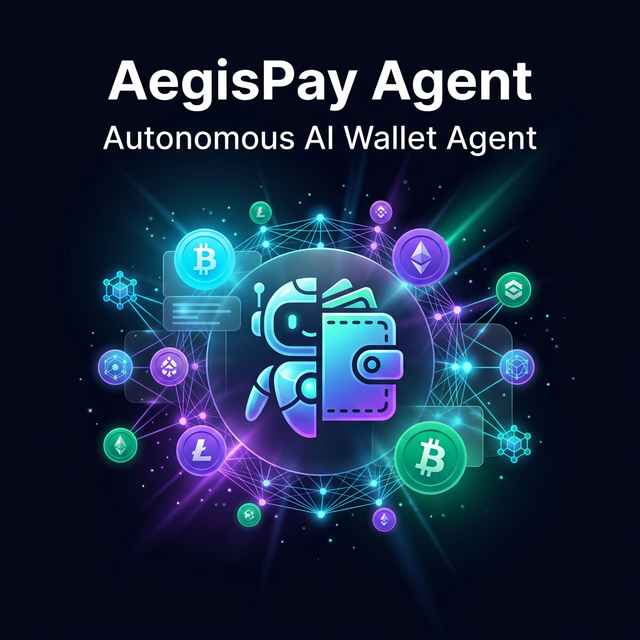
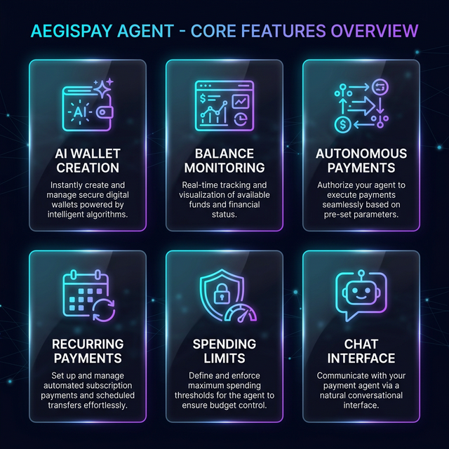
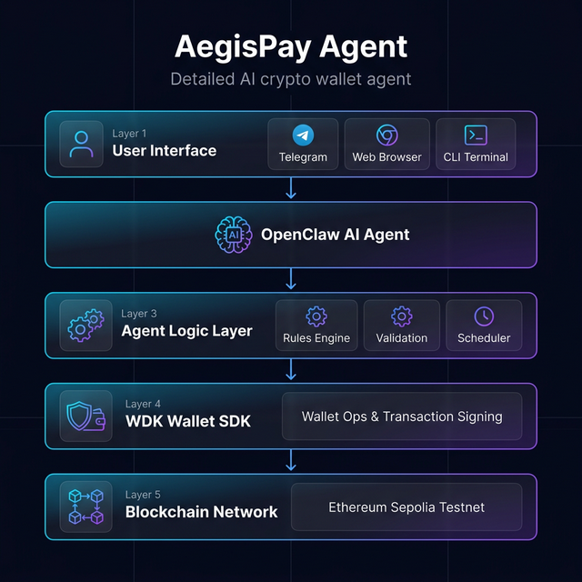
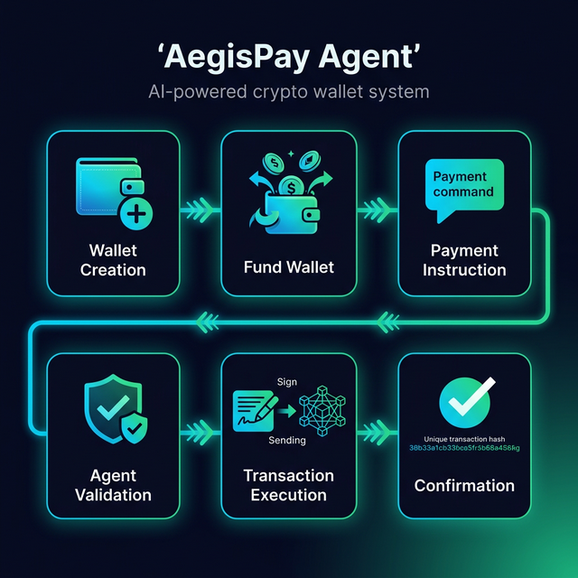
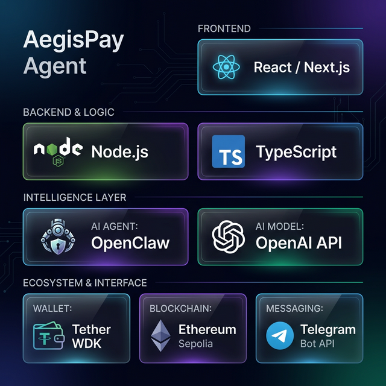
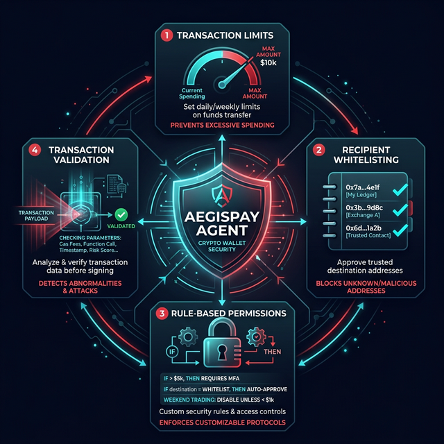

<p align="center">
  
</p>

<h1 align="center">AegisPay Agent</h1>

<p align="center">
  <strong>An autonomous AI wallet agent that manages crypto payments using programmable rules.</strong>
</p>

<p align="center">
  <a href="#-features"></a>
  <a href="#-technology-stack"></a>
  <a href="#-technology-stack"></a>
  <a href="#-technology-stack"></a>
  <a href="#-technology-stack"></a>
  <a href="#-technology-stack"></a>
</p>

<p align="center">
  <a href="#-quick-start">Quick Start</a> •
  <a href="#-features">Features</a> •
  <a href="#-architecture">Architecture</a> •
  <a href="#-demo">Demo</a> •
  <a href="./PRD.md">PRD</a> •
  <a href="./ROADMAP.md">Roadmap</a> •
  <a href="./PROJECT_STATUS.md">Project Status</a> •
  <a href="./docs/PROJECT_REVIEW.md">Project Review</a>
</p>

---

## 📖 Overview

**AegisPay Agent** is an AI-powered autonomous wallet agent built for the **Agent Wallets** hackathon track (WDK / OpenClaw and Agents Integration).

Using **Tether's Wallet Development Kit (WDK)** and the **OpenClaw** AI agent framework, the system enables users to define financial rules in natural language while the agent autonomously executes transactions on-chain.

The agent acts as an **independent financial actor** — capable of managing funds, making decisions, and executing payments under user-defined constraints.

The current build includes an animated React web UI, a wallet-connect entry flow, a Node.js API runtime, a shared agent engine, an optional WDK-backed wallet provider, a Telegram bridge, a Vercel serverless API bootstrap backed by a bundled CommonJS server app with lazy WDK loading, Alibaba Model Studio-compatible reasoning with model auto-switch fallback, an OpenClaw CLI reasoning path (with deterministic fallback), and automated tests for the core command and scheduling flows.

### 💡 What Makes AegisPay Different?

| Traditional Wallet | AegisPay Agent |
|---|---|
| Manual wallet creation | 🤖 AI creates wallets on command |
| Manually check balances | 📊 Agent monitors and reports automatically |
| Copy-paste addresses to send | 💬 "Send 10 USDT to Alice" |
| No spending controls | 🔒 AI enforces spending limits |
| No recurring payments | 📅 Agent handles subscriptions automatically |

---

## ✨ Features

<p align="center">
  
</p>

### 🔑 AI Wallet Creation
Create and manage self-custodial wallets using WDK through simple natural language commands.

```
User: "Create a new wallet"
Agent: ✅ Wallet created! Address: 0x1a2b...3c4d
```

### 📊 Balance Monitoring
Real-time tracking and visualization of available funds and financial status.

```
User: "What's my balance?"
Agent: 💰 Your wallet holds 150.00 USDT
```

### 💸 Autonomous Payments
Execute payments seamlessly with built-in validation and safety checks.

```
User: "Send 10 USDT to 0xAbC...123"
Agent: ✅ Transaction sent! Hash: 0x7f8e...9a0b
```

### 📅 Recurring Payments
Set up automated subscription payments and scheduled transfers.

```
User: "Pay 20 USDT for hosting every month"
Agent: 📅 Recurring payment scheduled: 20 USDT monthly
```

### 🔒 Spending Limits
Define and enforce maximum spending thresholds for budget control.

```
User: "Set daily limit to 100 USDT"
Agent: 🔒 Daily spending limit set: 100 USDT
```

### 💬 Chat Interface
Communicate with the agent via Telegram bot, web chat, or CLI.

### 🎨 Launch Experience
Guide users from the landing page into a wallet-connect step before entering the live agent console.

### 🧠 Runtime Modes

- **Demo mode** for local development without credentials
- **WDK mode** for live Sepolia wallet derivation, balance reads, and transfers when environment variables are configured
- **OpenAI-compatible reasoning mode** for optional intent classification through the Responses API with deterministic fallback and model auto-switch
- **Alibaba Model Studio mode** using Qwen models through the compatible-mode Responses endpoint

---

## 🏗️ Architecture

<p align="center">
  
</p>

### Architecture Layers

| Layer | Component | Responsibility |
|-------|-----------|----------------|
| **Layer 1** | User Interface | Telegram, Web Browser, CLI Terminal |
| **Layer 2** | OpenClaw AI Agent | AI reasoning & natural language processing |
| **Layer 3** | Agent Logic Layer | Rules Engine, Validation, Scheduler |
| **Layer 4** | WDK Wallet SDK | Wallet operations & transaction signing |
| **Layer 5** | Blockchain Network | Ethereum Sepolia Testnet |

### Data Flow

```
User sends command → AI parses intent → Agent validates rules
→ WDK signs transaction → Blockchain executes → Agent confirms
```

---

## 🔄 User Flow

<p align="center">
  
</p>

| Step | Action | Description |
|------|--------|-------------|
| **1** | 👛 Wallet Creation | User asks agent to create wallet via WDK |
| **2** | 💰 Fund Wallet | User sends tokens (faucet or transfer) |
| **3** | 💬 Payment Instruction | User gives payment command in natural language |
| **4** | ✅ Agent Validation | Agent checks balance, limits, and validity |
| **5** | ✍️ Transaction Execution | Agent signs and submits to blockchain |
| **6** | 📋 Confirmation | Agent returns TX hash and confirmation |

---

## 🛠️ Technology Stack

<p align="center">
  
</p>

| Category | Technology |
|----------|------------|
| **Frontend** | React / Next.js |
| **Backend** | Node.js, TypeScript |
| **AI Agent Framework** | OpenClaw CLI reasoning mode (optional) |
| **Wallet Infrastructure** | Tether Wallet Development Kit (WDK) |
| **Blockchain** | Ethereum Sepolia Testnet |
| **AI Model** | Alibaba Model Studio (Qwen) via OpenAI-compatible Responses API |
| **Messaging** | Telegram Bot API |

---

## 🔐 Security

<p align="center">
  
</p>

| Feature | Description |
|---------|-------------|
| **🔒 Transaction Limits** | Cap maximum amounts per transaction or period |
| **📋 Recipient Whitelisting** | Allow only pre-approved destination addresses |
| **⚙️ Rule-Based Permissions** | Enforce user-defined financial constraints |
| **✅ Transaction Validation** | Verify all parameters before signing |

> All wallets are **self-custodial** — users maintain full control of their assets.

---

## 🚀 Quick Start

### Prerequisites

- **Node.js** >= 22.x
- **npm** or **yarn**
- **Git**

### Installation

```bash
# Clone the repository
git clone https://github.com/panzauto46-bot/AegisPay-Agent.git
cd AegisPay-Agent

# Install dependencies
npm install

# Set up environment variables
cp .env.example .env
# Edit .env with your API keys
```

### Configuration

Create a `.env` file with the following variables:

```env
# Frontend
VITE_AEGIS_API_URL=/api

# API server
AEGIS_PORT=8787
AEGIS_SERVER_URL=http://localhost:8787
AEGIS_WALLET_PROVIDER=demo
AEGIS_REASONING_PROVIDER=openai
AEGIS_NETWORK_NAME=Ethereum Sepolia
AEGIS_EXPLORER_BASE_URL=https://sepolia.etherscan.io
AEGIS_SCHEDULER_ENABLED=true
AEGIS_SCHEDULER_INTERVAL_MS=60000
AEGIS_SCHEDULER_RUN_ON_START=false
# Optional cron auth secret (recommended for Vercel cron route)
CRON_SECRET=your_vercel_cron_secret

# Optional OpenAI-compatible reasoning
# Alibaba Model Studio example:
OPENAI_API_KEY=your_alibaba_model_studio_key
AEGIS_OPENAI_MODEL=qwen-plus
AEGIS_OPENAI_MODELS=qwen-plus,qwen-turbo,qwen3-8b,qwen3-4b
AEGIS_OPENAI_BASE_URL=https://dashscope-intl.aliyuncs.com/api/v2/apps/protocols/compatible-mode/v1

# Optional OpenClaw reasoning mode
# Requires a local OpenClaw CLI install
AEGIS_OPENCLAW_COMMAND=openclaw
AEGIS_OPENCLAW_TIMEOUT_MS=15000

# WDK live mode
AEGIS_WALLET_SEED_PHRASE=your_twelve_word_seed_phrase
AEGIS_EVM_RPC_URL=https://sepolia.infura.io/v3/your_key
AEGIS_USDT_TOKEN_ADDRESS=your_sepolia_usdt_contract
AEGIS_TOKEN_DECIMALS=6
AEGIS_TRANSFER_MAX_FEE_WEI=100000000000000

# Telegram bot
TELEGRAM_BOT_TOKEN=your_telegram_bot_token
```

### Run Development Stack

```bash
# Start API + web together
npm run dev:full

# Run only the API runtime
npm run start:api

# Optional: start the Telegram bridge once the API is running
npm run start:bot
```

### Multi-Model Fallback

If you want the reasoning layer to auto-switch models when the primary one runs out of quota or hits rate limits, set a comma-separated model list:

```env
AEGIS_REASONING_PROVIDER=openai
OPENAI_API_KEY=your_provider_key
AEGIS_OPENAI_BASE_URL=https://dashscope-intl.aliyuncs.com/api/v2/apps/protocols/compatible-mode/v1
AEGIS_OPENAI_MODELS=qwen-plus,qwen-turbo,qwen3-8b,qwen3-4b
```

The runtime will try the models in order and automatically move to the next one when it receives quota, free-tier, rate-limit, or model-support errors from the provider.

If you want to use OpenAI directly instead of Alibaba Model Studio, switch the base URL back to `https://api.openai.com/v1` and choose an OpenAI model such as `gpt-5-mini`.

To disable provider-backed reasoning entirely, set `AEGIS_REASONING_PROVIDER=deterministic`.

To use OpenClaw as the first reasoning layer (with automatic deterministic fallback), set:

```env
AEGIS_REASONING_PROVIDER=openclaw
AEGIS_OPENCLAW_COMMAND=openclaw
AEGIS_OPENCLAW_TIMEOUT_MS=15000
```

### WDK Funded Smoke Verification

To verify a real WDK wallet session before submission:

```bash
npm run verify:wdk
```

This command performs a read-only live check by default and fails fast when required WDK env vars are missing.

To execute a real transfer and produce a transaction hash:

```env
AEGIS_WDK_SMOKE_EXECUTE=true
AEGIS_WDK_SMOKE_AMOUNT=0.01
AEGIS_WDK_SMOKE_RECIPIENT=0xYourRecipientAddress
```

Then run `npm run verify:wdk` again. The script prints transaction hash and explorer URL on success.

### Vercel Deployment (Real Runtime)

This project now supports Vercel Functions for the backend API via `api/[...route].ts`, so `/api/*` runs in Vercel instead of falling back to local-only demo logic.

The Vercel entrypoint stays as an ES module, but it now bridges into a bundled CommonJS server app. WDK packages are lazy-loaded only when `AEGIS_WALLET_PROVIDER=wdk`, so demo-mode deployments do not touch WDK at startup. This avoids both the earlier `ERR_MODULE_NOT_FOUND` bootstrap issue and the `ERR_REQUIRE_ESM` crash pattern.

1. In Vercel, add these environment variables for your deployment:
   - `AEGIS_REASONING_PROVIDER=openai`
   - `OPENAI_API_KEY=<your_alibaba_model_studio_key>`
   - `AEGIS_OPENAI_BASE_URL=https://dashscope-intl.aliyuncs.com/api/v2/apps/protocols/compatible-mode/v1`
   - `AEGIS_OPENAI_MODEL=qwen-plus`
   - `AEGIS_OPENAI_MODELS=qwen-plus,qwen-turbo,qwen3-8b,qwen3-4b`
   - `CRON_SECRET=<strong-random-secret>`
2. Keep frontend API target as `VITE_AEGIS_API_URL=/api`.
3. Redeploy your project after saving env vars and code changes.
4. Check runtime health at `https://<your-vercel-domain>/api/health`.
5. Check state endpoint at `https://<your-vercel-domain>/api/state`.

Recurring scheduler automation is wired through Vercel Cron in `vercel.json` and calls `/api/scheduler/cron` every minute.

The production deployment path has been recovered with this bootstrap pattern, and `/api/health` plus `/api/state` now respond successfully on Vercel.

### Run Tests

```bash
# Run test suite
npm test

# Run type checking
npx tsc --noEmit
```

---

## 🎬 Demo

### Demo Scenario

The demo showcases end-to-end autonomous wallet operation:

| Step | Demo Action |
|------|-------------|
| 1️⃣ | Create wallet using the AI agent |
| 2️⃣ | Fund the wallet with test tokens |
| 3️⃣ | Ask the agent to check the balance |
| 4️⃣ | Request the agent to send a payment |
| 5️⃣ | Show the transaction on blockchain explorer |

> 🎥 [Demo Video](#) *(Coming Soon)*

---

## 📁 Project Structure

```text
aegispay-agent/
├── .env.example             # Runtime configuration template
├── api/                     # Vercel serverless API entrypoint
├── docs/
│   └── images/              # Visual diagrams and assets
├── src/
│   ├── components/          # Dashboard, chat, status, and management views
│   ├── data/                # Project status and roadmap metadata
│   ├── engine/              # Shared agent engine + wallet provider interfaces
│   ├── hooks/               # React hooks and client runtime
│   ├── lib/                 # Shared runtime, state, and serialization helpers
│   ├── server/              # API server, config, Telegram bot, WDK provider
│   ├── types/               # Shared TypeScript types
│   └── utils/               # Shared utilities
├── PRD.md                   # Product Requirements Document
├── PROJECT_STATUS.md        # Current implementation status
├── ROADMAP.md               # Development Roadmap
├── README.md                # This file
├── package.json
├── tsconfig.json
├── vercel.json              # Vercel function + cron configuration
└── vite.config.ts
```

---

## 📋 Hackathon Deliverables

| Deliverable | Status |
|-------------|--------|
| ✅ Public GitHub repository | Complete |
| 📝 Technical README documentation | Complete |
| 🏗️ Architecture explanation | Complete |
| 🎬 Demo video (max 5 minutes) | Pending |
| 🚀 Working prototype | Complete |

---

## 🗺️ Roadmap

See the full development roadmap: **[ROADMAP.md](./ROADMAP.md)**

| Phase | Description | Status |
|-------|-------------|--------|
| **Phase 1** | Foundation — Project setup & WDK integration | ✅ Mostly complete |
| **Phase 2** | AI Agent Core — command engine & reasoning layer | 🔄 In Progress |
| **Phase 3** | Payment Engine — autonomous payments & limits | ✅ Mostly complete |
| **Phase 4** | Advanced Features — recurring payments & chat | ✅ Mostly complete |
| **Phase 5** | Polish & Submit — testing, docs & submission | 🔄 In Progress |

---

## 🔮 Future Vision

| Feature | Description |
|---------|-------------|
| 🌐 Multi-chain support | Expand beyond Ethereum |
| 📈 DeFi integrations | Lending, staking, DEX access |
| 💼 Portfolio management | Automated asset optimization |
| 🤝 Agent-to-agent payments | Inter-agent financial operations |
| 🏪 Automation marketplace | Share & monetize payment rules |

---

## 🤝 Contributing

Contributions are welcome! Please follow these steps:

1. Fork the repository
2. Create a feature branch (`git checkout -b feature/amazing-feature`)
3. Commit your changes (`git commit -m 'Add amazing feature'`)
4. Push to the branch (`git push origin feature/amazing-feature`)
5. Open a Pull Request

---

## 📄 License

License file is still pending and will be added before submission.

---

## 📚 Related Documents

- 📋 [Product Requirements Document (PRD)](./PRD.md)
- 🗺️ [Development Roadmap](./ROADMAP.md)
- 📈 [Project Status](./PROJECT_STATUS.md)
- 🔍 [Project Review](./docs/PROJECT_REVIEW.md)

---

<p align="center">
  <strong>Built with ❤️ for the Agent Wallets Hackathon</strong>
  <br />
  <sub>Powered by Tether WDK • Qwen / Alibaba Model Studio • OpenClaw-ready architecture</sub>
</p>
