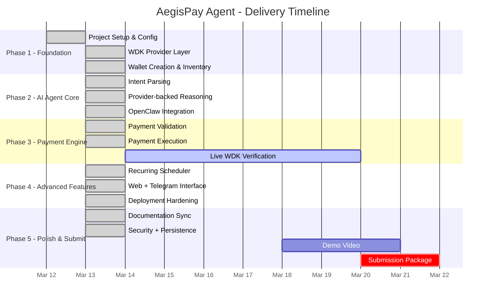

# AegisPay Agent - Development Roadmap

> Project: AegisPay Agent  
> Track: Agent Wallets (WDK / OpenClaw)  
> Start Date: March 2026  
> Submission Target: March 22, 2026

---

## Current Roadmap Snapshot

| Phase | Progress | Status | Outcome |
|-------|----------|--------|---------|
| Phase 1 - Foundation | 98% | In Progress | App shell, runtime, provider abstraction, wallet state, optional WDK integration, funded smoke tooling, and JSON persistence are ready. |
| Phase 2 - AI Agent Core | 95% | In Progress | Command understanding is functional with deterministic + provider-backed reasoning, and OpenClaw CLI routing is runtime-validated. |
| Phase 3 - Payment Engine | 90% | In Progress | Validation, payments, recurring execution, and explorer reporting are working in demo mode. |
| Phase 4 - Advanced Features | 98% | In Progress | Landing page, wallet-connect flow, web chat, Telegram bridge, scheduler path, production API auth/CORS enforcement, and deploy smoke verification tooling are live. |
| Phase 5 - Polish & Submit | 90% | In Progress | Docs, tests, UX polish, deployment/runtime validation, OpenClaw runtime validation, WDK/deploy smoke tooling, persistence, API auth/CORS hardening, LICENSE, and package rename are shipped; demo video and final submission assets remain. |
| Overall | 99% | In Progress | Full-stack MVP is stable and production-verified with security controls, persistence, and deployment checks; final funded proof + submission assets remain. |

---

## Timeline

---

## Phase 1 - Foundation

Goal: establish the app, API runtime, and wallet provider layer around the WDK flow.

### Shipped

- React + TypeScript + Vite app scaffold
- Shared agent state and runtime helpers
- Demo wallet provider and optional WDK provider abstraction
- Wallet creation, wallet inventory, and explorer-ready wallet state
- API runtime with state, command, wallet, rules, recurring, and scheduler endpoints
- WDK funded smoke script (`npm run verify:wdk`) with preflight env validation and execute mode

### Remaining

- Funded Sepolia verification execution with transaction hash evidence
- Deployment-grade secret handling for funded live verification

---

## Phase 2 - AI Agent Core

Goal: turn natural-language commands into wallet actions with clear fallback behavior.

### Shipped

- Deterministic intent parsing for wallet, balance, payments, recurring, rules, and status
- Provider-backed reasoning through an OpenAI-compatible Responses API
- Alibaba Model Studio local verification using `qwen-plus`
- Multi-model auto-switch fallback chain for quota/rate/model errors
- Shared reasoning layer reused by both API and frontend runtime
- OpenClaw CLI reasoning provider path with deterministic fallback

### Remaining

- Richer ambiguity handling and user confirmation flows

---

## Phase 3 - Payment Engine

Goal: execute payments safely with guardrails and runtime feedback.

### Shipped

- Single payment execution flow
- Balance checks before send
- Daily limit and max transaction rules
- Recipient whitelist and blacklist enforcement
- Transaction history and explorer links
- Recurring execution through the scheduler

### Remaining

- Funded live Sepolia transfer verification through WDK
- Confirmation polling and richer failure-state UX

---

## Phase 4 - Advanced Features

Goal: make the agent demo-ready and useful across channels.

### Shipped

- Full landing page with motion-heavy hero and animated sections
- Wallet-connect gate before entering the console
- Web chat interface
- Telegram bot bridge
- In-process recurring scheduler service
- JSON file persistence for wallets/rules/recurring/messages (`AEGIS_STATE_FILE_PATH`)
- API key auth middleware (`AEGIS_API_KEY`) and CORS allowlist (`AEGIS_ALLOWED_ORIGINS`)
- Project Status page backed by shared metadata
- Vercel catch-all API function path for `/api/*`
- Vercel cron schedule support for recurring scheduler execution
- CommonJS serverless bundle bootstrap bridged from the Vercel ES module entrypoint
- Lazy WDK loading so demo-mode deployments do not import WDK packages during startup
- Production `/api/health` and `/api/state` now return `200` on Vercel
- Deployment smoke verification script (`npm run verify:deploy`)

### Remaining

- Payment outcome notifications
- Production scheduler observability/alerting

---

## Phase 5 - Polish & Submit

Goal: stabilize, document, and package the project for judging.

### Shipped

- README, PRD, roadmap, project status, and project review docs
- Automated coverage for engine, API, reasoning fallback, and persistence/auth guards (19/19)
- Production build validation
- Landing/console UX polish
- Apache-2.0 `LICENSE`
- Package rename to `aegispay-agent`
- OpenClaw CLI runtime validation (`openclaw agent` + provider analyze live)
- Production deployment validation with API auth/CORS enforcement and passing `npm run verify:deploy`

### Remaining

- Demo video
- Funded WDK hash proof capture
- Final submission package

---

## Milestones

| Milestone | Target Date | Status | Note |
|-----------|-------------|--------|------|
| Project repo initialized | March 12, 2026 | ✅ Complete | Core app, docs, and runtime structure are in place. |
| WDK provider layer ready | March 13, 2026 | ✅ Complete | Optional WDK-backed provider is implemented and configurable. |
| Wallet creation shipped | March 13, 2026 | ✅ Complete | Wallet creation is available through agent flows. |
| AI command handling live | March 13, 2026 | ✅ Complete | Natural-language flows work across frontend and API. |
| First autonomous payment (demo mode) | March 13, 2026 | ✅ Complete | Demo-mode payment execution and recurring logic are live. |
| Web + Telegram interface ready | March 13, 2026 | ✅ Complete | Both user-facing channels are available. |
| Provider-backed AI verified locally | March 13, 2026 | ✅ Complete | Alibaba-compatible reasoning validated locally with `qwen-plus`. |
| Production deploy + API auth verification | March 13, 2026 | ✅ Complete | `/api/health` and `/api/state` verified in production (`401` without key, `200` with key). |
| Demo video ready | March 22, 2026 | 🔲 Pending | Mandatory submission asset before DoraHacks final submit. |
| Hackathon submission package ready | March 22, 2026 | 🔲 Pending | Final gate before submission. |

---

## Risks

| Risk | Impact | Likelihood | Mitigation |
|------|--------|------------|------------|
| Funded live WDK verification is still pending | High | Medium | Run a dedicated Sepolia smoke test with real credentials. |
| Provider-backed AI needs backend env configuration in deployment | Medium | Medium | Mirror the validated local Alibaba config into hosting secrets. |
| Deployed API security config can drift across environments | Medium | Medium | Enforce `AEGIS_API_KEY` + `AEGIS_ALLOWED_ORIGINS` in deployment env and validate with `npm run verify:deploy`. |

---

## Next Build Priorities

1. Provision/fund WDK env wallet and produce funded hash proof through `npm run verify:wdk`.
2. Record the demo video.
3. Prepare final submission assets and walkthrough notes.

---

> Last updated: March 13, 2026
