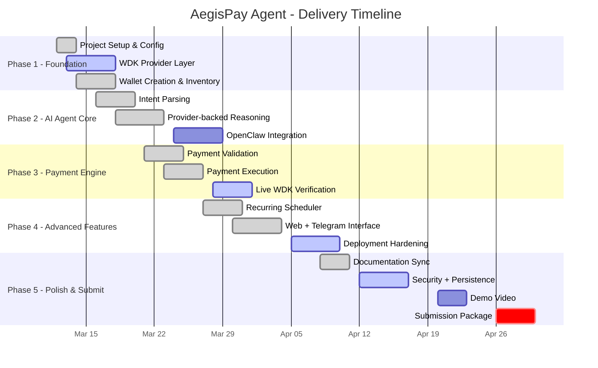

# AegisPay Agent - Development Roadmap

> Project: AegisPay Agent  
> Track: Agent Wallets (WDK / OpenClaw)  
> Start Date: March 2026  
> Submission Target: April 30, 2026

---

## Current Roadmap Snapshot

| Phase | Progress | Status | Outcome |
|-------|----------|--------|---------|
| Phase 1 - Foundation | 93% | In Progress | App shell, runtime, provider abstraction, wallet state, and optional WDK integration are ready. |
| Phase 2 - AI Agent Core | 80% | In Progress | Command understanding is functional with deterministic + provider-backed reasoning; OpenClaw remains the main gap. |
| Phase 3 - Payment Engine | 90% | In Progress | Validation, payments, recurring execution, and explorer reporting are working in demo mode. |
| Phase 4 - Advanced Features | 88% | In Progress | Landing page, wallet-connect flow, web chat, Telegram bridge, and scheduler are live. |
| Phase 5 - Polish & Submit | 52% | In Progress | Docs, tests, and UX polish are shipped; demo video and final submission hardening remain. |
| Overall | 84% | In Progress | Full-stack MVP is ready; track-specific and submission-specific work is still pending. |

---

## Timeline

---

## Phase 1 - Foundation

Goal: establish the app, API runtime, and wallet provider layer around the WDK flow.

### Shipped

- React + TypeScript + Vite app scaffold
- Shared agent state and runtime helpers
- Demo wallet provider and optional WDK provider abstraction
- Wallet creation, wallet inventory, and explorer-ready wallet state
- API runtime with state, command, wallet, rules, recurring, and scheduler endpoints

### Remaining

- Funded Sepolia verification using the WDK path
- Deployment-grade secret handling review

---

## Phase 2 - AI Agent Core

Goal: turn natural-language commands into wallet actions with clear fallback behavior.

### Shipped

- Deterministic intent parsing for wallet, balance, payments, recurring, rules, and status
- Provider-backed reasoning through an OpenAI-compatible Responses API
- Alibaba Model Studio local verification using `qwen-plus`
- Multi-model auto-switch fallback chain for quota/rate/model errors
- Shared reasoning layer reused by both API and frontend runtime

### Remaining

- OpenClaw-native integration
- Richer ambiguity handling and user confirmation flows

---

## Phase 3 - Payment Engine

Goal: execute payments safely with guardrails and runtime feedback.

### Shipped

- Single payment execution flow
- Balance checks before send
- Daily limit and max transaction rules
- Recipient whitelist and blacklist enforcement
- Transaction history and explorer links
- Recurring execution through the scheduler

### Remaining

- Funded live Sepolia transfer verification through WDK
- Confirmation polling and richer failure-state UX

---

## Phase 4 - Advanced Features

Goal: make the agent demo-ready and useful across channels.

### Shipped

- Full landing page with motion-heavy hero and animated sections
- Wallet-connect gate before entering the console
- Web chat interface
- Telegram bot bridge
- In-process recurring scheduler service
- Project Status page backed by shared metadata

### Remaining

- Payment outcome notifications
- Deployment worker/cron option for scheduler durability
- Public deployment env sync for backend AI runtime

---

## Phase 5 - Polish & Submit

Goal: stabilize, document, and package the project for judging.

### Shipped

- README, PRD, roadmap, project status, and project review docs
- Automated coverage for engine, API, and reasoning fallback
- Production build validation
- Landing/console UX polish

### Remaining

- Demo video
- Security review
- Persistence layer
- API authentication
- `LICENSE` file
- `package.json` rename cleanup
- Final submission package

---

## Milestones

| Milestone | Target Date | Status | Note |
|-----------|-------------|--------|------|
| Project repo initialized | March 12, 2026 | ✅ Complete | Core app, docs, and runtime structure are in place. |
| WDK provider layer ready | March 17, 2026 | ✅ Complete | Optional WDK-backed provider is implemented and configurable. |
| Wallet creation shipped | March 20, 2026 | ✅ Complete | Wallet creation is available through agent flows. |
| AI command handling live | March 28, 2026 | ✅ Complete | Natural-language flows work across frontend and API. |
| First autonomous payment | April 5, 2026 | ✅ Complete | Demo-mode payment execution and recurring logic are live. |
| Web + Telegram interface ready | April 20, 2026 | ✅ Complete | Both user-facing channels are available. |
| Provider-backed AI verified locally | March 12, 2026 | ✅ Complete | Alibaba-compatible reasoning validated locally with `qwen-plus`. |
| Demo video ready | April 28, 2026 | 🔲 Pending | Mandatory submission asset. |
| Hackathon submission package ready | April 30, 2026 | 🔲 Pending | Final gate before submission. |

---

## Risks

| Risk | Impact | Likelihood | Mitigation |
|------|--------|------------|------------|
| OpenClaw is still missing | High | High | Prioritize an OpenClaw wrapper/planner before submission. |
| Funded live WDK verification is still pending | High | Medium | Run a dedicated Sepolia smoke test with real credentials. |
| Runtime state is in-memory only | Medium | Medium | Add JSON or SQLite persistence before final demo. |
| Provider-backed AI needs backend env configuration in deployment | Medium | Medium | Mirror the validated local Alibaba config into hosting secrets. |
| API is unauthenticated | Medium | Medium | Add at least an API key guard before public backend exposure. |

---

## Next Build Priorities

1. Integrate OpenClaw into the reasoning/planning path.
2. Run a funded WDK Sepolia smoke test.
3. Add persistence for runtime state.
4. Add API authentication and tighten CORS.
5. Record the demo video.
6. Add `LICENSE` and rename the package to `aegispay-agent`.
7. Prepare final submission assets and walkthrough notes.

---

> Last updated: March 12, 2026
