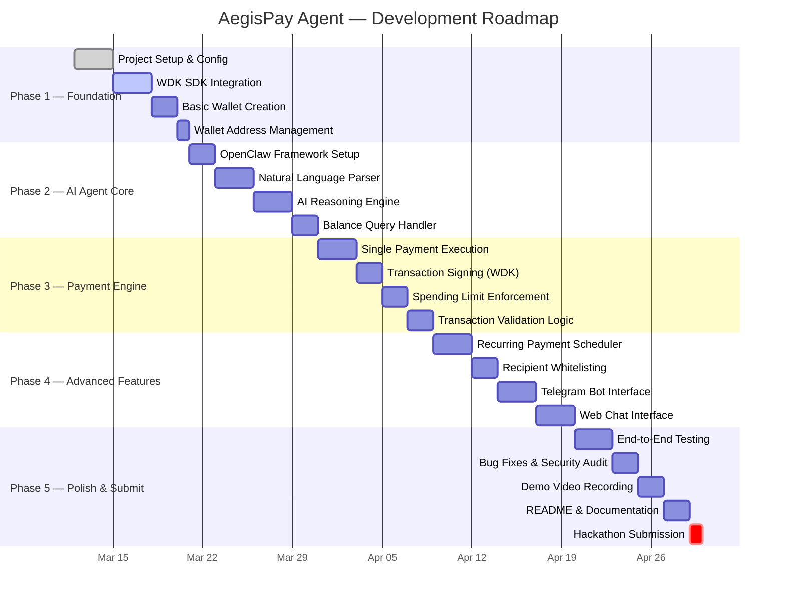
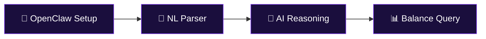
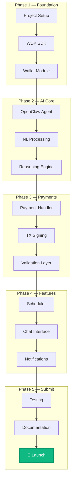
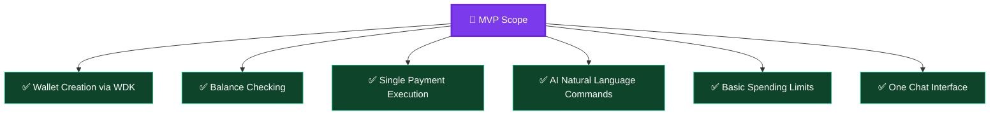

# 🗺️ AegisPay Agent — Development Roadmap

> **Project:** AegisPay Agent  
> **Track:** Agent Wallets (WDK / OpenClaw)  
> **Start Date:** March 2026  
> **Target:** Hackathon Submission  

---

## 📊 Roadmap Timeline



---

## 🏗️ Phase Breakdown

### Phase 1 — Foundation *(Week 1-2)*

> 🎯 **Goal:** Set up the project infrastructure and integrate WDK for basic wallet operations.


| Task | Description | Priority | Status |
|------|-------------|----------|--------|
| Project scaffolding | Initialize Node.js + TypeScript project with Vite | 🔴 High | ✅ Done |
| WDK SDK installation | Install and configure Tether WDK | 🔴 High | 🔄 In Progress |
| Wallet generation | Implement wallet creation via WDK API | 🔴 High | 🔲 Pending |
| Address management | Display and manage wallet addresses | 🟡 Medium | 🔲 Pending |
| Key management | Secure private key handling | 🔴 High | 🔲 Pending |
| Environment config | Set up `.env`, API keys, network config | 🟡 Medium | 🔲 Pending |

**Deliverables:**
- ✅ Working project repository
- ✅ WDK integrated and tested
- ✅ Wallet creation functional

---

### Phase 2 — AI Agent Core *(Week 2-3)*

> 🎯 **Goal:** Build the AI reasoning layer using OpenClaw that can understand user commands.



| Task | Description | Priority | Status |
|------|-------------|----------|--------|
| OpenClaw integration | Set up OpenClaw AI agent framework | 🔴 High | 🔲 Pending |
| Intent recognition | Parse user commands into structured intents | 🔴 High | 🔲 Pending |
| AI reasoning engine | Decision-making logic for financial operations | 🔴 High | 🔲 Pending |
| Balance monitoring | Query and report wallet balances via WDK | 🟡 Medium | 🔲 Pending |
| Transaction history | Fetch and display recent transactions | 🟢 Low | 🔲 Pending |
| Error handling | Graceful AI fallbacks and error messages | 🟡 Medium | 🔲 Pending |

**Deliverables:**
- ✅ OpenClaw agent functional
- ✅ Natural language commands working
- ✅ Balance queries operational

---

### Phase 3 — Payment Engine *(Week 3-4)*

> 🎯 **Goal:** Enable the agent to execute autonomous payments with validation and spending controls.


| Task | Description | Priority | Status |
|------|-------------|----------|--------|
| Payment execution | Send tokens to specified addresses | 🔴 High | 🔲 Pending |
| WDK transaction signing | Sign transactions securely via WDK | 🔴 High | 🔲 Pending |
| Balance validation | Check sufficient funds before sending | 🔴 High | 🔲 Pending |
| Spending limits | Enforce daily/per-transaction limits | 🟡 Medium | 🔲 Pending |
| Transaction parameters | Validate gas, amount, recipient | 🟡 Medium | 🔲 Pending |
| TX confirmation | Return transaction hash and status | 🟡 Medium | 🔲 Pending |

**Deliverables:**
- ✅ Single payment execution working
- ✅ Spending limits enforced
- ✅ Transaction validation complete

---

### Phase 4 — Advanced Features *(Week 4-5)*

> 🎯 **Goal:** Add recurring payments, whitelisting, and user-facing chat interfaces.


| Task | Description | Priority | Status |
|------|-------------|----------|--------|
| Recurring scheduler | Cron-like scheduler for periodic payments | 🟡 Medium | 🔲 Pending |
| Subscription management | Create, update, cancel recurring payments | 🟡 Medium | 🔲 Pending |
| Recipient whitelist | Allow/block specific addresses | 🟡 Medium | 🔲 Pending |
| Telegram bot | Build Telegram bot interface | 🟡 Medium | 🔲 Pending |
| Web chat UI | React-based chat interface | 🟢 Low | 🔲 Pending |
| Notification system | Alert users on payment events | 🟢 Low | 🔲 Pending |

**Deliverables:**
- ✅ Recurring payments operational
- ✅ At least one chat interface working
- ✅ Whitelist feature functional

---

### Phase 5 — Polish & Submit *(Week 5-6)*

> 🎯 **Goal:** Finalize, test, document, and submit to the hackathon.


| Task | Description | Priority | Status |
|------|-------------|----------|--------|
| E2E testing | Test complete user flows end-to-end | 🔴 High | 🔲 Pending |
| Security review | Audit transaction safety and key handling | 🔴 High | 🔲 Pending |
| Bug fixes | Address issues found during testing | 🔴 High | 🔲 Pending |
| Demo video | Record 5-minute demo video | 🔴 High | 🔲 Pending |
| README | Write comprehensive technical README | 🔴 High | 🔲 Pending |
| Architecture docs | Document system architecture | 🟡 Medium | 🔲 Pending |
| GitHub repo | Clean up repo, add license, badges | 🟡 Medium | 🔲 Pending |
| **Hackathon submission** | **Submit all deliverables** | 🔴 **Critical** | 🔲 Pending |

**Deliverables:**
- ✅ All tests passing
- ✅ Demo video recorded
- ✅ Documentation complete
- ✅ **Hackathon submitted!** 🎉

---

## 🏛️ Architecture Evolution



---

## 📈 Progress Tracker

### Overall Progress

```
Phase 1 — Foundation       ██░░░░░░░░░░░░░░░░░░  10%
Phase 2 — AI Agent Core    ░░░░░░░░░░░░░░░░░░░░   0%
Phase 3 — Payment Engine   ░░░░░░░░░░░░░░░░░░░░   0%
Phase 4 — Advanced Features░░░░░░░░░░░░░░░░░░░░   0%
Phase 5 — Polish & Submit  ░░░░░░░░░░░░░░░░░░░░   0%
─────────────────────────────────────────────────
Overall                    █░░░░░░░░░░░░░░░░░░░   2%
```

### Key Milestones

| Milestone | Target Date | Status |
|-----------|-------------|--------|
| 🏗️ Project repo initialized | March 12, 2026 | ✅ Complete |
| 📦 WDK integrated | March 17, 2026 | 🔄 In Progress |
| 👛 First wallet created | March 20, 2026 | 🔲 Pending |
| 🤖 AI agent responds to commands | March 28, 2026 | 🔲 Pending |
| 💸 First autonomous payment | April 5, 2026 | 🔲 Pending |
| 📅 Recurring payments working | April 15, 2026 | 🔲 Pending |
| 💬 Chat interface live | April 20, 2026 | 🔲 Pending |
| 🧪 All tests passing | April 25, 2026 | 🔲 Pending |
| 🎬 Demo video ready | April 28, 2026 | 🔲 Pending |
| 🚀 **Hackathon submitted** | **April 30, 2026** | 🔲 **Pending** |

---

## ⚠️ Risk Assessment

| Risk | Impact | Likelihood | Mitigation |
|------|--------|------------|------------|
| WDK API limitations | 🔴 High | 🟡 Medium | Early integration testing, direct contact with Tether devs |
| OpenClaw compatibility issues | 🟡 Medium | 🟡 Medium | Prepare fallback to direct LLM API calls |
| Testnet instability | 🟡 Medium | 🟢 Low | Use multiple RPC providers, implement retry logic |
| AI hallucination in commands | 🔴 High | 🟡 Medium | Strict validation layer, confirmation prompts |
| Time constraints | 🔴 High | 🟡 Medium | Prioritize core features, cut scope if needed |
| Security vulnerabilities | 🔴 High | 🟢 Low | Security-first design, code review, testing |

---

## 🎯 MVP Scope (Minimum for Hackathon)

If time is limited, the **Minimum Viable Product** must include:



### Nice-to-Have (If Time Permits)
- 📅 Recurring payments
- 📋 Recipient whitelisting
- 🔔 Notification system
- 💻 Multiple chat interfaces (Telegram + Web)

---

## 📝 Notes

- **Update this roadmap** regularly as progress is made
- **Adjust timelines** based on actual velocity
- **Focus on MVP** first, then expand
- **Demo quality** matters — invest time in a polished demo video

---

> *Last Updated: March 12, 2026*
