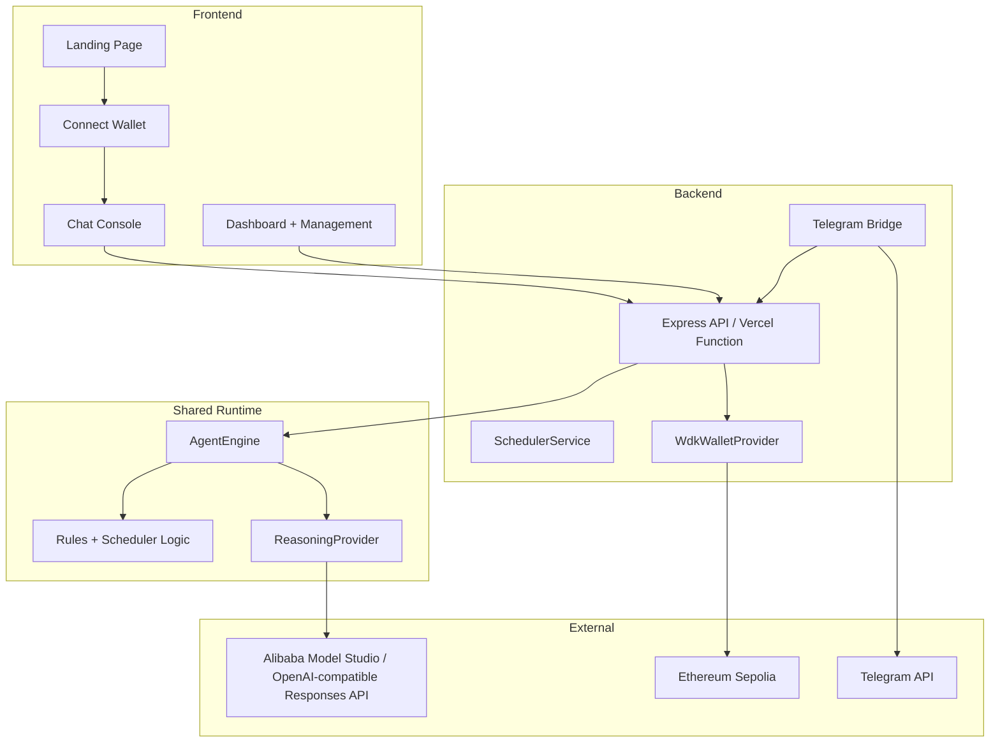

# AegisPay Agent - Project Review

Review date: March 13, 2026  
Target hackathon: Agent Wallets (WDK / OpenClaw)  
Submission deadline: March 22, 2026

## Executive Summary

| Metric | Value |
|--------|-------|
| Overall progress | 98% |
| TypeScript errors | 0 |
| Test suites | 5 |
| Tests | 19/19 passed |
| Source files in `src/` | 42 |
| Source lines in `src/` | ~6,660 |
| Build output | `dist/index.html` (~535 KB) |
| Current runtime state | Full-stack MVP |

The project is in strong MVP shape. The product story is clear thanks to the animated landing page and wallet-connect entry flow, and the backend now has a credible runtime model with provider-backed reasoning, scheduler execution, Telegram bridge, optional WDK support, JSON persistence, API auth + CORS controls, and a Vercel serverless deployment path with a CommonJS bundle plus lazy WDK loading stable in production. OpenClaw CLI integration is wired and runtime-validated in a real local session, and both funded WDK and deployed-runtime smoke scripts are in place. The most important remaining gaps are funded WDK execution proof and final hackathon deliverables such as the demo video and submission assets.

## Current Architecture

## What Is Strong

### 1. Product entry flow is much better

- The landing page now sells the product before dropping users into the app.
- `Launch Console` no longer feels abrupt because it routes through a wallet-connect step first.
- This makes the hackathon demo feel more intentional and easier to present.

### 2. Runtime architecture is clean

- The provider pattern is solid:
  - `WalletProvider` abstracts demo vs WDK behavior
  - `ReasoningProvider` abstracts deterministic vs provider-backed AI behavior
- The shared `AgentEngine` is reused across frontend and backend, which keeps business logic centralized.

### 3. AI provider fallback is now credible

- The reasoning layer supports an OpenAI-compatible Responses API.
- The current local validation path works with Alibaba Model Studio/Qwen.
- Multi-model fallback is implemented, so quota/rate-limit/provider errors can roll over to the next configured model before falling back to deterministic parsing.
- OpenClaw CLI can now be used as a first-pass reasoning layer and falls back to deterministic parsing if unavailable.
- OpenClaw runtime was validated with a real local session (`openclaw agent --local --session-id ...`) and the provider now uses session-aware invocation.

### 4. Core wallet and payment flows are there

- Wallet creation
- Balance checks
- Single payment execution
- Spending guardrails
- Recurring scheduling
- Transaction/explorer reporting

That is enough to demonstrate the intended product loop.

### 5. The project is documented well

- `PRD.md`
- `ROADMAP.md`
- `PROJECT_STATUS.md`
- `docs/PROJECT_REVIEW.md`
- README

The docs now form a more coherent story than earlier revisions.

### 6. Real deployment path is now available

- API routes can run in Vercel via `api/[...route].ts`.
- Scheduler automation can be triggered by Vercel Cron through `/api/scheduler/cron`.
- Optional `CRON_SECRET` bearer validation is implemented for cron calls.
- The Vercel bootstrap path now uses a bundled CommonJS server app with lazy WDK loading, which removes unnecessary WDK startup imports in demo mode and is a better fit for the current Express runtime.

### 7. Security and persistence hardening now landed

- Optional API key guard (`AEGIS_API_KEY`) protects non-public API routes.
- CORS is now configurable via allowlist (`AEGIS_ALLOWED_ORIGINS`) and is no longer implicitly wildcard in production defaults.
- Runtime state persistence is now file-based (`AEGIS_STATE_FILE_PATH`), so restarts do not wipe wallets/rules/recurring/messages.
- Package naming cleanup (`aegispay-agent`) and Apache-2.0 `LICENSE` are now done.

## Main Gaps

### High severity

#### 1. Live WDK verification is still pending

The WDK provider exists and `npm run verify:wdk` is in place. Read-only validation works, but there is still no funded Sepolia verification hash because the configured wallet is not funded yet.

### Medium severity

#### 2. Deployment still needs backend env setup hardening

The deployment path exists now and production health/runtime/state endpoints are responding. `npm run verify:deploy` has already been validated against production. Remaining deployment work is now operational hardening: keep Vercel env vars consistent (Alibaba-compatible API key, model list, base URL, API key, CORS origins) and improve scheduler observability.

#### 3. Test coverage is still selective

Coverage is improving, but it is still focused on:
- engine core
- API endpoints
- reasoning model fallback

UI flows and Telegram bridge behavior are still missing from automated tests.

#### 4. Submission polish items remain open

- demo video
- final submission packaging

## Updated Metrics

| Area | Current state |
|------|---------------|
| Landing + UX | Strong hackathon demo quality |
| Wallet flow | Ready in demo mode, optional WDK path present |
| AI runtime | Alibaba-compatible reasoning verified locally and deployable via Vercel Functions |
| Scheduler | Working in-process + Vercel cron path available |
| Security | API key auth + CORS allowlist controls are implemented |
| Persistence | JSON state persistence is wired and active |
| Tests | 19/19 passing |
| README accuracy | Improved and aligned with runtime |
| Submission readiness | Not done yet (but deployment runtime is now stable) |

## Hackathon Readiness

| Deliverable | Status | Notes |
|-------------|--------|-------|
| Public GitHub repository | ✅ Complete | Repo is live and docs now reference the correct project. |
| Technical documentation | ✅ Complete | README, PRD, roadmap, status, and review are aligned. |
| Working prototype | ✅ Complete | Landing, connect-wallet, chat, API, scheduler, and Telegram bridge are functional. |
| Demo video | ❌ Pending | Mandatory remaining deliverable. |
| Track-specific OpenClaw story | ✅ Complete | OpenClaw CLI path is implemented and runtime-validated in a real session. |

## Recommended Next Steps

1. Run a funded WDK Sepolia smoke test and document the result.
2. Record the demo video using the new landing-to-console flow.
3. Finalize submission package artifacts and disclosures.

## Overall Assessment

Rating: 9.4/10

The project is no longer just a rough prototype. It now looks and behaves like a polished MVP with a credible architecture, security/persistence hardening, validated OpenClaw runtime behavior, and a presentable user journey. The remaining work is mostly about funded WDK proof and final submission assets, not rebuilding core product capability.
