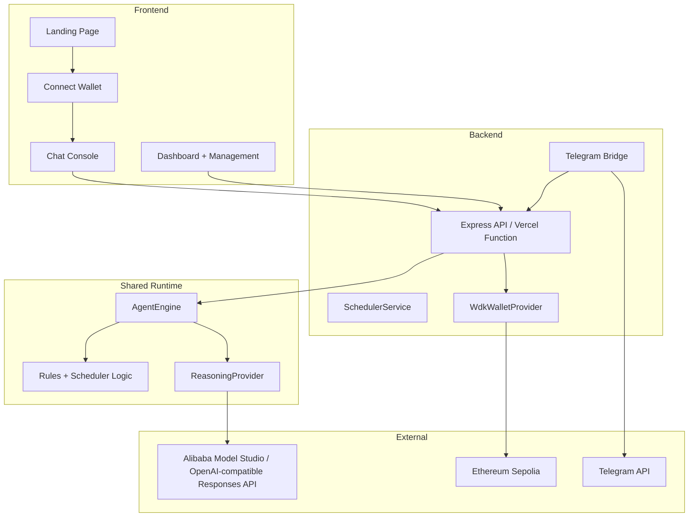

# AegisPay Agent - Project Review

Review date: March 13, 2026  
Target hackathon: Agent Wallets (WDK / OpenClaw)  
Submission deadline: March 22, 2026

## Executive Summary

| Metric | Value |
|--------|-------|
| Overall progress | 99% |
| TypeScript errors | 0 |
| Test suites | 6 |
| Tests | 23/23 passed |
| Source files in `src/` | 45 |
| Source lines in `src/` | ~7,014 |
| Build output | `dist/index.html` (~535 KB) |
| Current runtime state | Production-verified full-stack MVP |

The project is in strong submission shape. The backend deployment path on Vercel is now verified end-to-end with API auth enforcement and state persistence active in production, while the frontend experience remains polished for demo flow (landing -> connect wallet -> console). Core agent behavior, provider-backed reasoning, scheduler flows, and Telegram integration are all functional. The main remaining scope is submission packaging work, not core engineering rework.

## Current Architecture

## What Is Strong

### 1. Production deployment is now validated

- `/api/health` returns `200` with security/persistence metadata.
- `/api/state` returns `401` without API key and `200` with valid `x-aegis-api-key`.
- `npm run verify:deploy` passes against production with expected providers.

### 2. Runtime architecture is clean

- `WalletProvider` abstraction cleanly separates demo and WDK behavior.
- `ReasoningProvider` abstraction cleanly separates deterministic, OpenAI-compatible, and OpenClaw reasoning paths.
- Shared `AgentEngine` keeps core business logic centralized across frontend and backend.

### 3. AI provider story is credible

- OpenAI-compatible Responses API flow is working with Alibaba Model Studio/Qwen.
- Multi-model fallback chain is implemented before deterministic fallback.
- OpenClaw CLI path is session-aware, runtime-validated, and now covered by `npm run verify:openclaw`.

### 4. Core product loop is complete for MVP demo

- Wallet creation and balance checks
- Payment execution with guardrails
- Recurring schedules and scheduler runs
- Explorer links and transaction history

### 5. Documentation and release hygiene improved

- `README.md`, `ROADMAP.md`, `PROJECT_STATUS.md`, and this review are aligned.
- Apache-2.0 `LICENSE` is present.
- Package naming and deployment scripts are consistent with current architecture.

## Main Gaps

### High severity

#### 1. Funded WDK proof is still pending

`npm run verify:wdk` now includes multi-account scan + funded-account selection, but a funded Sepolia execution hash is still required for final proof if the submission claims live funded flow.

### Medium severity

#### 2. Submission assets remain open

- Demo video (<= 5 minutes, unlisted)
- Final DoraHacks package + disclosures

#### 3. Coverage focus is still core-heavy

Automated coverage is strong for engine/API/provider flows, but UI regression and Telegram bridge end-to-end scenarios are still thin.

## Updated Metrics

| Area | Current state |
|------|---------------|
| Landing + UX | Strong hackathon demo quality |
| Wallet flow | Ready in demo mode, optional WDK path present |
| AI runtime | Alibaba-compatible reasoning and OpenClaw fallback both validated |
| Scheduler | In-process service + Vercel cron endpoint available |
| Security | API key auth + CORS allowlist controls active and verified in production; Telegram bridge forwards API key header |
| Persistence | JSON state persistence active in production (`/tmp/aegispay-agent-state.json`) |
| Tests | 23/23 passing |
| Deploy verification | `npm run verify:deploy` passing |
| Submission readiness | Close to done; non-code deliverables remain |

## Hackathon Readiness

| Deliverable | Status | Notes |
|-------------|--------|-------|
| Public GitHub repository | ✅ Complete | Repository is live and synced with latest deployment architecture. |
| Technical documentation | ✅ Complete | README, roadmap, status, and review are updated and consistent. |
| Working prototype | ✅ Complete | Landing, connect-wallet, API runtime, scheduler path, and Telegram bridge are functional. |
| Demo video | ❌ Pending | Mandatory remaining deliverable. |
| Track-specific OpenClaw story | ✅ Complete | OpenClaw CLI path is implemented and runtime-validated. |

## Recommended Next Steps

1. Execute funded Sepolia WDK smoke verification and capture transaction hash proof.
2. Record the demo video using the current production flow.
3. Finalize and submit the DoraHacks package.

## Overall Assessment

Rating: 9.6/10

The project has moved from strong MVP to near-submission-ready production demo quality. Remaining work is concentrated on funded proof and submission assets rather than architecture or runtime stability.
