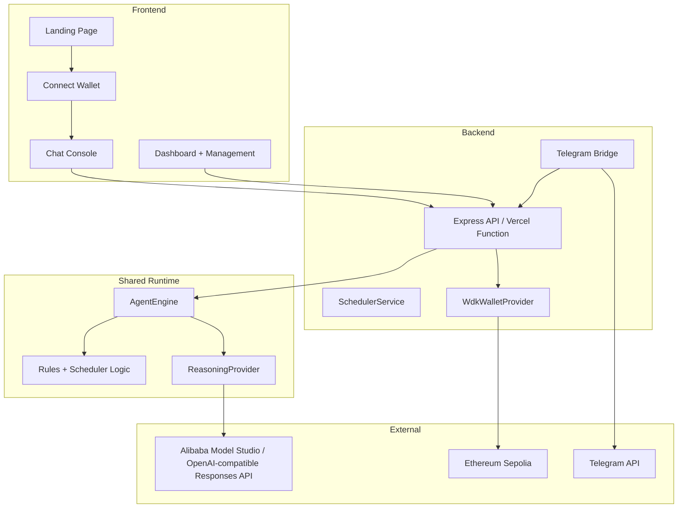

# AegisPay Agent - Project Review

Review date: March 13, 2026  
Target hackathon: Agent Wallets (WDK / OpenClaw)  
Submission deadline: March 22, 2026

## Executive Summary

| Metric | Value |
|--------|-------|
| Overall progress | 92% |
| TypeScript errors | 0 |
| Test suites | 4 |
| Tests | 12/12 passed |
| Source files in `src/` | 38 |
| Source lines in `src/` | ~6,380 |
| Build output | `dist/index.html` (~524 KB) |
| Current runtime state | Full-stack MVP |

The project is in strong MVP shape. The product story is now much clearer thanks to the animated landing page and wallet-connect entry flow, and the backend has a credible runtime model with provider-backed reasoning, scheduler execution, Telegram bridge, optional WDK support, and a Vercel serverless deployment path with a CommonJS bundle plus lazy WDK loading now stable in production. OpenClaw CLI integration is now wired as an optional reasoning path with deterministic fallback. The most important remaining gaps are live OpenClaw runtime validation, funded WDK verification, persistence/auth hardening, and final hackathon deliverables such as the demo video and submission assets.

## Current Architecture

## What Is Strong

### 1. Product entry flow is much better

- The landing page now sells the product before dropping users into the app.
- `Launch Console` no longer feels abrupt because it routes through a wallet-connect step first.
- This makes the hackathon demo feel more intentional and easier to present.

### 2. Runtime architecture is clean

- The provider pattern is solid:
  - `WalletProvider` abstracts demo vs WDK behavior
  - `ReasoningProvider` abstracts deterministic vs provider-backed AI behavior
- The shared `AgentEngine` is reused across frontend and backend, which keeps business logic centralized.

### 3. AI provider fallback is now credible

- The reasoning layer supports an OpenAI-compatible Responses API.
- The current local validation path works with Alibaba Model Studio/Qwen.
- Multi-model fallback is implemented, so quota/rate-limit/provider errors can roll over to the next configured model before falling back to deterministic parsing.
- OpenClaw CLI can now be used as a first-pass reasoning layer and falls back to deterministic parsing if unavailable.

### 4. Core wallet and payment flows are there

- Wallet creation
- Balance checks
- Single payment execution
- Spending guardrails
- Recurring scheduling
- Transaction/explorer reporting

That is enough to demonstrate the intended product loop.

### 5. The project is documented well

- `PRD.md`
- `ROADMAP.md`
- `PROJECT_STATUS.md`
- `docs/PROJECT_REVIEW.md`
- README

The docs now form a more coherent story than earlier revisions.

### 6. Real deployment path is now available

- API routes can run in Vercel via `api/[...route].ts`.
- Scheduler automation can be triggered by Vercel Cron through `/api/scheduler/cron`.
- Optional `CRON_SECRET` bearer validation is implemented for cron calls.
- The Vercel bootstrap path now uses a bundled CommonJS server app with lazy WDK loading, which removes unnecessary WDK startup imports in demo mode and is a better fit for the current Express runtime.

## Main Gaps

### High severity

#### 1. OpenClaw runtime validation is still pending

OpenClaw CLI reasoning is now integrated in code, but it still needs end-to-end runtime proof with a real `openclaw agent` execution flow and demo evidence.

#### 2. Live WDK verification is still pending

The WDK provider exists, but there is still no funded Sepolia verification recorded in the docs or tests. Until that happens, live blockchain capability is implemented but not fully proven.

#### 3. No persistence layer

Runtime state still lives in memory. A server restart wipes wallets, rules, recurring schedules, and chat history. This is acceptable for local iteration, but risky for a demo or public deployment.

#### 4. No API authentication

The backend still lacks an auth gate. If publicly exposed as-is, anyone who can reach the API can trigger commands and scheduler actions.

### Medium severity

#### 5. Deployment still needs backend env setup hardening

The deployment path exists now and production health/state endpoints are responding. Remaining deployment work is mostly hardening: ensure Vercel env vars stay correct (Alibaba-compatible API key, model list, and base URL), add auth/CORS tightening, and keep runtime observability for cron/scheduler behavior.

#### 6. Test coverage is still selective

Coverage is improving, but it is still focused on:
- engine core
- API endpoints
- reasoning model fallback

UI flows, Telegram bridge behavior, and live-provider smoke tests are still missing.

#### 7. Submission polish items remain open

- demo video
- `LICENSE`
- `package.json` rename cleanup
- final submission packaging

## Updated Metrics

| Area | Current state |
|------|---------------|
| Landing + UX | Strong hackathon demo quality |
| Wallet flow | Ready in demo mode, optional WDK path present |
| AI runtime | Alibaba-compatible reasoning verified locally and deployable via Vercel Functions |
| Scheduler | Working in-process + Vercel cron path available |
| Tests | 12/12 passing |
| README accuracy | Improved and aligned with runtime |
| Submission readiness | Not done yet (but deployment runtime is now stable) |

## Hackathon Readiness

| Deliverable | Status | Notes |
|-------------|--------|-------|
| Public GitHub repository | ✅ Complete | Repo is live and docs now reference the correct project. |
| Technical documentation | ✅ Complete | README, PRD, roadmap, status, and review are aligned. |
| Working prototype | ✅ Complete | Landing, connect-wallet, chat, API, scheduler, and Telegram bridge are functional. |
| Demo video | ❌ Pending | Mandatory remaining deliverable. |
| Track-specific OpenClaw story | 🟠 In Progress | OpenClaw CLI path is implemented; runtime proof is still required. |

## Recommended Next Steps

1. Validate OpenClaw with a real CLI session and record proof.
2. Run a funded WDK Sepolia smoke test and document the result.
3. Add persistence so the runtime survives restarts.
4. Add basic API authentication before any public backend exposure.
5. Record the demo video using the new landing-to-console flow.
6. Add `LICENSE` and rename the package to `aegispay-agent`.

## Overall Assessment

Rating: 8.8/10

The project is no longer just a rough prototype. It now looks and behaves like a polished MVP with a credible architecture and a presentable user journey. The remaining work is mostly about validation, compliance with the track requirements, and final submission hardening rather than rebuilding the core product.
